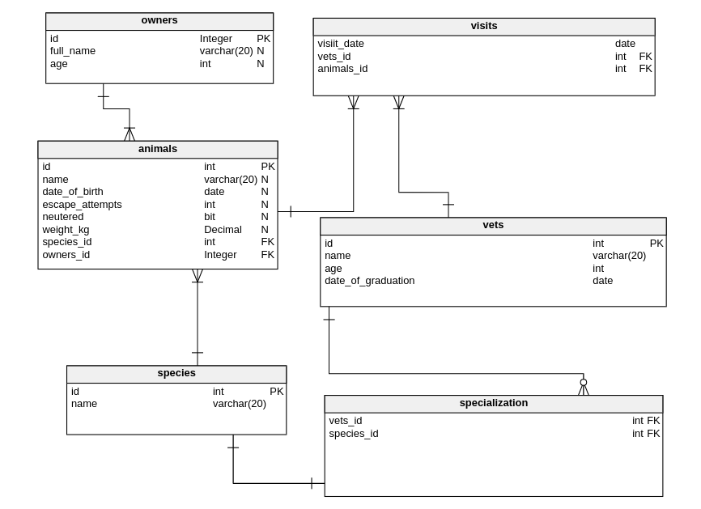

# Vet Clinic

## Diagram

## General info
Used PostgreSQL to create the  data structure for a vet clinic. You will create a table to store animals' owners, vets and relation between. Inserting data into tables, and query data.

 ## Technologies
Project is created with:
* PostgreSQL

## Setup
To run this project, install it locally using:
- cd Desktop
- git clone https://github.com/VuDej/vet_clinic.git
- Use  [schema.sql](./schema.sql) to create all tables.
- Use [data.sql](./data.sql) to add data to tables.
- Use [data.sql](./data.sql) to run database.

## Author

👤 **Dejan Vujovic**

- Github : [@VuDej](https://github.com/VuDej)
- Twitter: [@DejanVuj](https://twitter.com/DejanVuj)
- LinkedIn : [@Dejan-Vujovic](https://www.linkedin.com/in/dejan-vujovic-5a0672225/)

## 🤝 Contributing

Contributions, issues, and feature requests are welcome!

Feel free to check the [issues page](https://github.com/VuDej/vet_clinic/issues/1).

## Show your support

Give a ⭐️ if you like this project!

## Acknowledgments

A special thanks to Microverse.

## 📝 License

This project is [MIT](LICENSE) licensed.

## Contact
Created by [@VuDej](https://github.com/VuDej)
